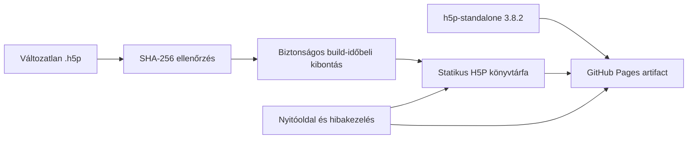

# Architektúradöntés

## Döntés

A változatlan `.h5p` fájl build-időben kibontott telepítési példányát a `h5p-standalone@3.8.2` statikus runtime jeleníti meg GitHub Pages-en.

A Lumi export két dinamikus médiakönyvtárat (`H5P.Audio-1.5`, `H5P.Video-1.6`) az alkalmazásszintű könyvtártárból használ, ezért ezeket a futtatókörnyezet külön, SHA-256-tal rögzített csomagból teszi a kibontott könyv mellé. Ez nem változtatja meg a forrás `.h5p` csomagot.

## Miért nem közvetlen `.h5p`?

A `.h5p` ZIP-csomag, nem önálló HTML-dokumentum. A böngésző nem oldja fel magától a H5P könyvtárfüggőségeket és nem inicializálja a H5P Core-t.

## Miért build-időben bontjuk ki?

- A forráscsomag változatlan és ellenőrizhető marad.
- A látogatóknak nem kell minden alkalommal ZIP-et letölteniük és memóriában kibontaniuk.
- Minden fájl hagyományos statikus assetként cache-elhető.
- A hibák CI-ben, publikálás előtt észlelhetők.
- A GitHub Pages teljesen backend nélkül ki tudja szolgálni.

## Adatfolyam

## Nem cél

- H5P szerkesztés;
- tartalom- vagy médiaátalakítás;
- szerveroldali felhasználókezelés;
- eredmények központi tárolása;
- Lumi Cloud beágyazás.
