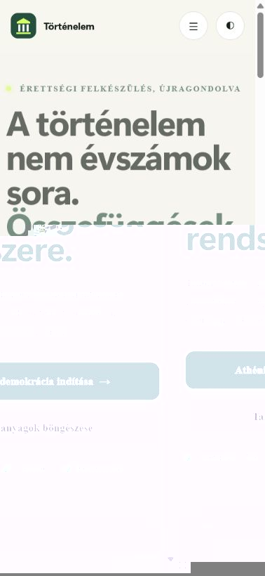
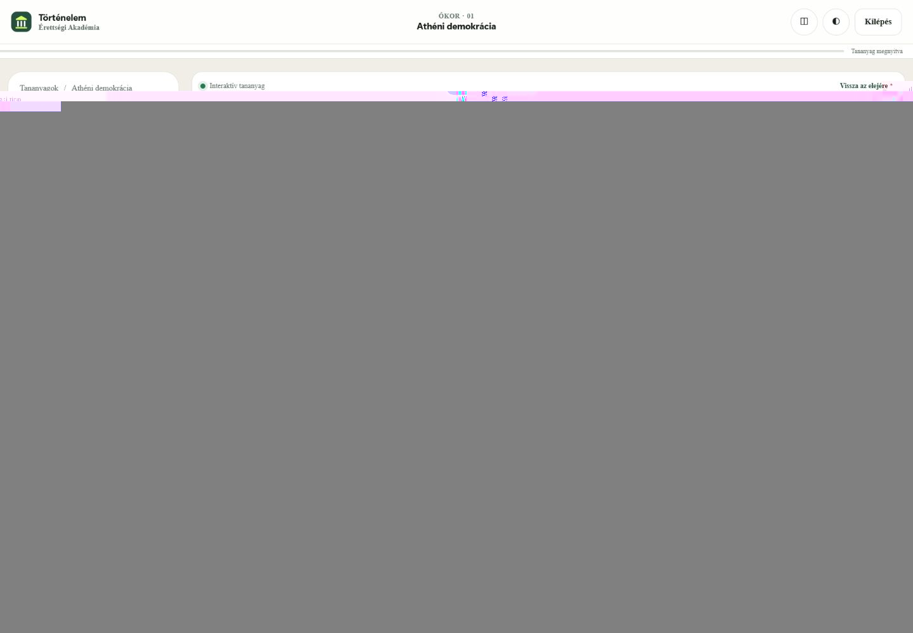
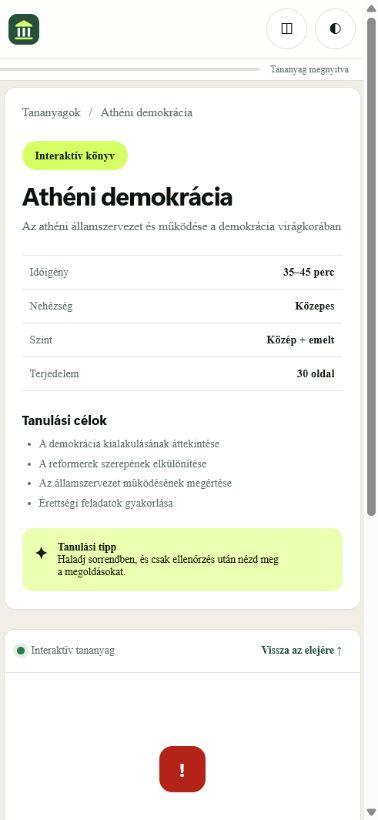

# UI/UX képernyőképek

## Nyitóoldal – asztali nézet

## Digitális könyvtár – asztali nézet

## Nyitóoldal – mobilnézet

## Tananyagkeret – asztali és mobilnézet

A helyi képeken a tananyagkeret hibaállapota látható, mert a korlátozott helyi környezetben nem volt letölthető a teljes H5P runtime. A Pull Request GitHub Actions futása a valódi `h5p-standalone` csomaggal ellenőrzi az interaktív könyvet.

